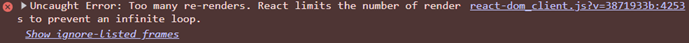

# Psyche - Bug Log

<details>
<summary>Symbols</summary>

|     | Meaning        |
| --- | -------------- |
| 🐛  | Bug            |
| 🔍  | Cause          |
| 🔧  | Fix            |
| 💡  | Takeaway       |
| 👀  | Thing to watch |
| ⚠️  | Warning        |

</details>

## 2026-08-23

### `ThoughtsScreen.jsx` - Too many re-renders

- **🐛** Nothing rendered on screen. React DevTools reports "Too many re-renders".

  

  <br>

- **🔍** The state setter sat loose in the component body, so it ran on every render:

  ```jsx
  const [input, setInput] = useState("");
  const [thoughts, setThoughts] = useState([]);

  setThoughts([...thoughts, input]); // runs on every render
  ```

  Render &rarr; set state &rarr; state changes &rarr; render again. The loop never stops, so React aborts.

  <br>

- **🔧** Wrote an `addThought()` function and moved the call inside. It now runs only on click and on Enter.

  ```jsx
  <button onClick={addThought}>+</button>
  <input onKeyDown={(e) => e.key === "Enter" && addThought()} />
  ```

  <br>

- **💡** Rendering describes the UI. Changing state is an action, so it needs a trigger, either an event handler or an effect.
