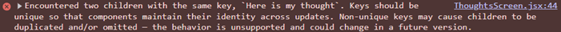

# Psyche - Bug Log

<details>
<summary>Symbols</summary>

|     | Meaning        |
| --- | -------------- |
| 🐛  | Bug            |
| 🔍  | Cause          |
| 🔧  | Fix            |
| 💡  | Takeaway       |
| 👀  | Thing to watch |
| ⚠️  | Warning        |

</details>

## 2026-08-23

### `ThoughtsScreen.jsx` - Too many re-renders

- **🐛** Nothing rendered on screen. React DevTools reports "Too many re-renders".

  

- **🔍** The state setter sat loose in the component body, so it ran on every render:

  ```jsx
  const [input, setInput] = useState("");
  const [thoughts, setThoughts] = useState([]);

  setThoughts([...thoughts, input]); // Render -> set state -> state changes -> render again. The loop never stops, so React aborts.
  ```

- **🔧** Wrote an `addThought()` function and moved the call inside. It now runs only on click and on Enter.

  ```jsx
  <button onClick={addThought}>+</button>
  <input onKeyDown={(e) => e.key === "Enter" && addThought()} />
  ```

- **💡** Rendering describes the UI. Changing state is an action, so it needs a trigger, either an event handler or an effect.

## 2026-08-27

### `ThoughtsScreen.jsx` - Duplicate keys in the cloud list

- **🐛** Adding the same thought twice produced two clouds with the same key.

  

- **🔍** The thought text was used as the key, since `thoughts` held plain strings:

  ```jsx
    <li className="cloud float" key={thought}>
  ```

- **🔧** Thoughts are now objects with their own id. The map reads the entries separately, id for the key, text for the screen:

  ```jsx
  const newThought = { id: crypto.randomUUID(), text: input };

  <li className="cloud float" key={thought.id}>
    <span className="cloud-text">{thought.text}</span>
  ```

- **💡** A key must be stable and unique. Displayed data is neither, since the user can repeat it.

## 2026-08-30

### `useTypewriter.js` - No export in hook file

- **🐛** `does not provide an export named 'default'`
- **🔍** Function had no `export` keyword, import used default form.
- **🔧** Added `export`, changed import to `{ useTypewriter }`.
- **💡** Named export needs braces, default doesn't. Both sides must match.

---

### `useTypewriter.js` - Assigned variable instead of state

- **🐛** Typewriter ran, placeholder stayed empty.
- **🔍** Copied vanilla `placeholder = ...`. In React that variable is connected to nothing.
- **🔧** Used `setWriting(...)` instead.
- **💡** Only state changes trigger a repaint. Never assign, always call the setter.

---

### `useTypewriter.js` - setInterval in render body

- **🐛** Every render started another timer.
- **🔍** Side effects don't belong in the render pass.
- **🔧** Moved it into `useEffect` with `[]` and a `clearInterval` cleanup.
- **💡** Render describes, effects act.

---

### `useTypewriter.js` - Hook returned nothing

- **🐛** `useTypewriter(...)` gave back `undefined`.
- **🔍** State updated fine, but no `return` statement.
- **🔧** Added `return writing` at the end of the hook.
- **💡** React re-runs the hook on every render, so one return line is enough.
